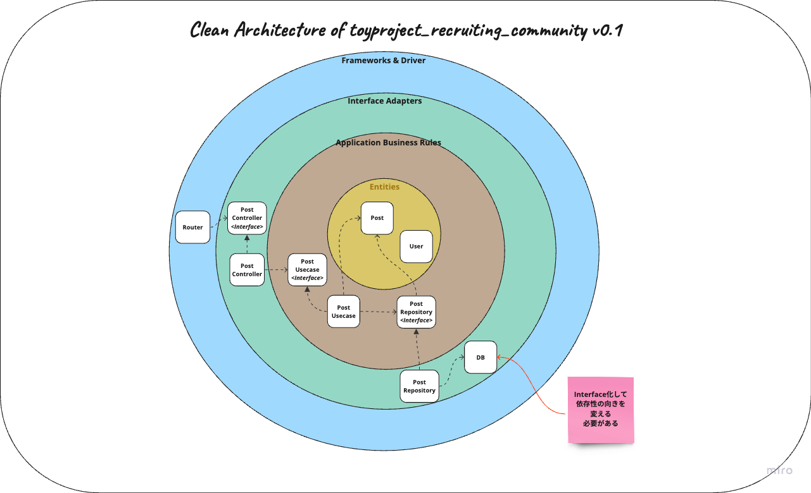
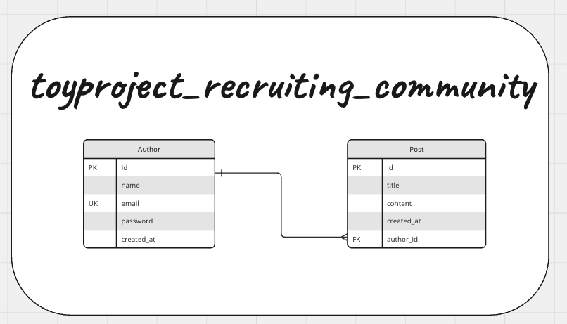

# ToyProject Recruiting Community With Golang
## 目標
- Go言語の勉強
- Ginの勉強
- 個人プロジェクトの開始
- Clean Architectureの理解
- Go言語でのTDDの勉強

## 技術スタック
- Gin
  - シェアが一番高いため採用
- Gorm
  - シェアが一番高いため採用
  - `.ent`は後で勉強してみる
- Postgresql
- AWS
  - GCPと悩むがシェアが高い方を選択
- Terraform
  - Infra as a Codeの勉強

## 要件
### v0.1スコープ
- 募集の投稿ができる
- 投稿した募集の編集ができる
- 投稿した募集の詳細が見える
- 投稿した募集の削除ができる
- 新規ユーザー作成ができる
- 全てのユーザーが作成した投稿が見える
### v0.1スコープ以後
- ログインができる
- ログアウトができる
- ユーザー脱退ができる
- ユーザーが作成した投稿のみが見える
- ...どんどん追加していく！
- MSA化

## Architecture
### v0.1スコープ
- Clean Architectureを採用



### v0.1スコープ以後
- MSA導入

## ERD



## 実装中の悩み

### カプセル化
- Go言語の`struct`をカプセル化がしたいがどうすればいいか
  - structを返り値のタイプとして使う場合
  - `&struct{}`でインスタンスが生成できてしまいカプセル化ができない
  - compileエラーも出ないので困る
  - filedを小文字化し外部からの参照を防ぐ

**コンストラクタを提供してparameterを渡さないとcompileエラーが出るようにする方法**
- 伝統的な方法で使い勝手も良いと感じた
```go
type PostResponse struct {
	id      uint   `json:"id" binding:"required"`
	title   string `json:"title" binding:"required"`
	content string `json:"content" binding:"required"`
}

func NewPostResponse(id uint, title, content string) *PostResponse {
	return &PostResponse{
		id:      id,
		title:   title,
		content: content,
	}
}
```

**structのInitメソッドを作成する方法**
- 使い勝手が悪いなと感じた。
```go
type PostResponse struct {
  id      uint   `json:"id" binding:"required"`
  title   string `json:"title" binding:"required"`
  content string `json:"content" binding:"required"`
}

func (pr PostResponse) Init(id uint, title, content string) {
  pr.id = id
  pr.title = title
  pr.content = content
}

// new()でインスタンスを生成
r := new(response.PostResponse)
// Initメソッドで初期化
r.Init()
```

### 返り値が一目に見えない
- Controller の宣言部のみをみると何を返しいるかが把握できない
- 注釈をつけて（つけたくないが）何を返しているかを見えるようにする
```go
type PostController interface {
Create(ctx *gin.Context)

	// FindById return response.PostResponse
	FindById(ctx *gin.Context)

	// FindAll return []response.PostResponse
	FindAll(ctx *gin.Context)

	// Update return response.PostResponse
	Update(ctx *gin.Context)

	RemoveById(ctx *gin.Context)
}
```


- プロジェクト全体のerror handlingのやり方

- pointerタイプとそうではないタイプの使い分けに関して調べてみる。 
  - 重いオブジェクトにだけポインタータイプを使うのか